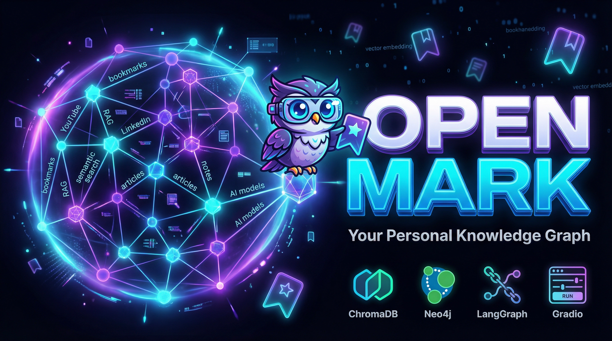

<div align="center">

</div>

# OpenMark

**Personal knowledge graph + multi-agent orchestrator for everything you've ever saved.**

OpenMark ingests bookmarks, LinkedIn saved posts, and YouTube videos into a Neo4j Graph RAG store with semantic embeddings, then puts a v3 LangChain orchestrator on top that delegates to 10 specialist sub-agents (researcher, 5 composers, humanizer, polisher, verifier, skill-author).

Built by [Ahmad Othman Ammar Adi](https://github.com/OthmanAdi).

---

## What it does

- Pulls saved content from Raindrop, Edge / Chrome bookmarks, LinkedIn saved posts, YouTube playlists / liked / watch-later
- Embeds with [pplx-embed](https://huggingface.co/collections/perplexity-ai/pplx-embed) (1024 dim, local, free) or Azure embedding deployments
- Stores everything in **Neo4j** with vector index + tag co-occurrence edges + SIMILAR_TO neighbors + Louvain communities
- Runs a single LangChain v1 orchestrator on Azure AI Foundry frontier models (gpt-5.5, gpt-5.3-codex, grok-4.3, claude-opus-4-7, deepseek-reasoner, ...)
- Delegates work to 10 task_* sub-agents via pure LangChain middleware (`SubAgent`-style, no deepagents):
  - `task_researcher` — 21 retrieval + web tools
  - `task_compose_linkedin / essay / roundup / comparison / analytical` — schema-strict Pydantic outputs
  - `task_humanize` (ar-msa / ar-egt / ar-shami / he) and `task_polish` (English) — voice scrubbers
  - `task_verify` — 4-check VerificationReport with surgical fix_instructions
  - `task_author_skill` — sandboxed runtime skill author
- Serves a Gradio UI with Search, Chat, Stats, Graph 3D, Add, Agent Tools, Agent Skills tabs
- CLI: `python scripts/search.py "RAG tools"`

---

## Architecture in one picture

```
                            Your saved content
                                   │
                            pipeline/normalize
                                   │
                          pplx-embed (1024 dim)
                                   │
                              Neo4j Graph RAG
                            (vector index + tags
                             + SIMILAR_TO + Louvain)
                                   │
                            ┌──────┴──────┐
                            │             │
                       Gradio UI      LangChain v1
                       (Search /      orchestrator
                        Chat /        (Foundry: gpt-5.5
                        Stats / ...)   or grok-4.3)
                                          │
                  ┌───────────────────────┼───────────────────────┐
                  │                       │                       │
        task_researcher (21)   task_compose_* (5 formats)   task_polish / task_humanize
                  │                       │                       │
                  └───────────────────────┴───────────────────────┘
                                          │
                                     task_verify
                                  (VerificationReport,
                                   retry-loop on fail)
                                          │
                                    Final answer
```

Every middleware comes from `langchain.agents.middleware`. No deepagents.

---

## Requirements

- Python 3.13+
- Neo4j (Desktop or AuraDB) with `openmark` database
- Azure AI Foundry account (recommended for the agent — gpt-5.5 / gpt-5.3-codex / grok-4.3) OR a local OpenAI-compatible server (Ollama / llama.cpp / vLLM) for `AGENT_PROVIDER=local`
- ~1.2 GB free disk for local pplx-embed (one-time download)

---

## Setup

```bash
git clone https://github.com/OthmanAdi/OpenMark.git
cd OpenMark
pip install -r requirements.txt
cp .env.example .env
# edit .env (see below)
```

Minimum `.env`:

```env
# Embedding (local pplx, recommended)
EMBEDDING_PROVIDER=pplx
PPLX_QUERY_MODEL=perplexity-ai/pplx-embed-v1-0.6b
PPLX_DOC_MODEL=perplexity-ai/pplx-embed-context-v1-0.6b

# Azure AI Foundry (the LLM stack)
AZURE_ENDPOINT=https://<your-resource>.openai.azure.com/
AZURE_API_KEY=<key>
AZURE_API_VERSION=2025-04-01-preview

# v3 role -> Foundry deployment overrides (optional; sensible defaults shipped)
OPENMARK_MODEL_ORCHESTRATOR=gpt-5.5
OPENMARK_MODEL_CLASSIFIER=gpt-4.1-mini
OPENMARK_MODEL_SUMMARIZER=gpt-4.1-mini
OPENMARK_MODEL_RESEARCHER=gpt-5.3-codex
OPENMARK_MODEL_COMPOSER=gpt-5.5
OPENMARK_MODEL_HUMANIZER=gpt-5
OPENMARK_MODEL_POLISHER=gpt-4.1-mini
OPENMARK_MODEL_VERIFIER=gpt-5-mini
OPENMARK_MODEL_SKILL_AUTHOR=gpt-4.1-mini

# Legacy back-compat keys still honored:
AZURE_DEPLOYMENT_EXECUTOR=grok-4.3        # -> orchestrator + researcher
AZURE_DEPLOYMENT_CLASSIFIER=gpt-4.1-mini  # -> summarizer + classifier + polisher + skill_author
AZURE_DEPLOYMENT_SYNTHESIZER=gpt-5.3-codex # -> composer + humanizer
AZURE_DEPLOYMENT_PLANNER=gpt-5.3-codex     # -> verifier

# Neo4j
NEO4J_URI=bolt://127.0.0.1:7687
NEO4J_USER=neo4j
NEO4J_PASSWORD=<password>
NEO4J_DATABASE=openmark

# Optional web research
TAVILY_API_KEY=<key>          # unlocks web_search / web_fetch / web_extract / web_crawl
BRAVE_API_KEY=<key>           # web_search fallback
GITHUB_TOKEN=<token>          # raises GitHub API rate limit
```

### Ingest

```bash
# Full pipeline (Neo4j only — ChromaDB was removed in v3)
python scripts/ingest.py

# Fast: skip SIMILAR_TO edges (saves 25-40 min)
python scripts/ingest.py --skip-similar
```

### Launch UI

```bash
python -m openmark.ui.app
# open http://127.0.0.1:7860
```

### CLI search

```bash
python scripts/search.py "RAG tools"
python scripts/search.py "LangGraph" --category "Agent Development"
python scripts/search.py --tag "rag"
python scripts/search.py --stats
```

---

## The agent (v3)

One `create_agent` graph, 14 middleware, 11 tools (10 task_* delegators + write_skill).

| Middleware (in order) | Source | What it does |
|---|---|---|
| `classify_intent` (`@before_model`) | `openmark.agent.classification` | Slash → regex → fast LLM. Writes `state.intent` once per thread. |
| `dynamic_orchestrator_prompt` (`@dynamic_prompt`) | `openmark.agent.classification` | Reads `state.intent`, injects matching system prompt with live KB stats. |
| `ContextEditingMiddleware(ClearToolUsesEdit)` | langchain | Trims old tool outputs at 120k tokens, keeps last 4. |
| `SummarizationMiddleware` | langchain | Triggers at 100k tokens or 80 messages, keeps last 24. Uses cheap summarizer model. |
| `TodoListMiddleware` | langchain | Adds `write_todos` so the agent plans before fanning out. |
| `ModelCallLimitMiddleware` | langchain | Hard cap 30 model calls per turn. |
| `ToolCallLimitMiddleware` | langchain | Global 40 + per-tool caps on expensive composers. |
| `ModelRetryMiddleware` | langchain | 3 retries, exponential backoff. |
| `slash_skill_loader` (`@before_model`) | `openmark.agent.middleware` | `/<skill>` pre-loads matching SKILL.md and strips the slash from the message. |
| `OpenMarkSkillMiddleware` | `openmark.agent.middleware` | Skill catalogue + `load_skill` tool. |
| `ToolRetryMiddleware` | langchain | 2 retries on flaky sub-agent calls. |
| `tool_event_middleware` (`@wrap_tool_call`) | `openmark.agent.middleware` | Captures every tool start / end / error for UI cards. |

Checkpointer: `SqliteSaver` at `data/openmark_agent.db` — threads survive restart.

### Sub-agents

Each is a compiled `create_agent` graph exposed to the orchestrator as a `@tool`. They live in `openmark/agent/subagents/`. Composer + verifier sub-agents use `response_format=ToolStrategy(<Schema>)` so the orchestrator receives validated Pydantic structured outputs.

| Sub-agent | Tools | Response schema | Triggered by |
|---|---|---|---|
| `task_researcher` | 21 (15 graph + 6 web) | — | every retrieval path |
| `task_compose_linkedin` | 0 | `LinkedInPost` | `/newsletter-thread`, "LinkedIn post on X" |
| `task_compose_essay` | 0 | `NewsletterEssay` | `/newsletter-essay` |
| `task_compose_roundup` | 0 | `NewsletterRoundup` | `/newsletter-roundup` |
| `task_compose_comparison` | 0 | `NewsletterComparison` | `/newsletter-comparison` |
| `task_compose_analytical` | 0 | `NewsletterAnalytical` | `/newsletter on X` (default) |
| `task_humanize` | 0 | — | language is `ar-msa`, `ar-egt`, `ar-shami`, or `he` |
| `task_polish` | 0 | — | language is `en` |
| `task_verify` | 0 | `VerificationReport` | post-compose retry-loop guard |
| `task_author_skill` | `write_skill` | — | "bake this prompt into a reusable skill" |

---

## Slash commands (Chat tab)

```
/fast-search <query>            quick one-shot lookup
/deep-research <topic>          multi-angle research with synthesis
/newsletter <topic>             analytical newsletter (default shape)
/newsletter-essay <topic>       long-form thesis essay, 600-900 words
/newsletter-roundup <window>    categorical news roundup (3-6 buckets)
/newsletter-comparison <A vs B> side-by-side comparison + table + picks
/newsletter-thread <topic>      LinkedIn / short-form post (250-400 words)
/weekly-digest                  last-7-days recap, grouped by category
/bookmark-dive <URL>            single URL + graph_expand neighbors
/repo-research <owner/repo>     GitHub repo intel + related saves
/niche-hunter <theme>           find under-discussed corners of the KB
```

Plain English also works — the intent classifier middleware routes everything that isn't a slash.

---

## Foundry model bank

`openmark/models/foundry.py` ships a typed registry of 25 frontier deployments sourced from [models.dev](https://models.dev) and cross-verified against provider announcements (gpt-5.5 1M ctx, claude-opus-4-7 1M ctx, grok-4.3 1M ctx, deepseek-reasoner 1M ctx, etc). Helpers:

```python
from openmark.models import get, context_window, supports_reasoning, role_model_id

get("gpt-5.5").context_window         # -> 1_050_000
supports_reasoning("grok-4.3")        # -> True
role_model_id("orchestrator")         # -> resolves from .env or ROLE_DEFAULTS
```

`openmark/models/router.py` maps roles to deployments with `OPENMARK_MODEL_<ROLE>` overrides taking precedence over legacy `AZURE_DEPLOYMENT_*` keys.

---

## Tests

```bash
# Pure-unit tests (no LLM, no Neo4j)
pytest tests/ -q
# -> 99 passed, 7 skipped

# Live Foundry e2e (real API calls, ~18 min total)
OPENMARK_RUN_LIVE_E2E=1 pytest tests/agent/test_live_foundry.py -v
# -> 7 passed:
#    test_classifier_writes_state_intent
#    test_researcher_returns_anchor_list
#    test_compose_analytical_full_loop
#    test_compose_linkedin_emits_structured
#    test_verifier_runs_on_compose_path
#    test_polisher_routes_for_english
#    test_humanizer_routes_for_arabic
```

---

## Project layout

```
openmark/
├── agent/
│   ├── classification.py     # @before_model + @dynamic_prompt for intent
│   ├── graph.py              # build_agent() + ask() + ask_stream()
│   ├── llms.py               # build_orchestrator / classifier / summarizer / ...
│   ├── middleware.py         # OpenMarkSkillMiddleware + slash_skill_loader + tool_event_middleware
│   ├── schemas.py            # Pydantic shapes (LinkedInPost, Newsletter*, VerificationReport)
│   ├── skills.py             # SKILL.md loader (openmark-* / humanizer-* / agent-generated-*)
│   ├── tools.py              # 22 @tool functions (graph + web) + write_skill
│   ├── web.py                # httpx / Tavily / Brave / DDG / GitHub / Reddit transport
│   └── subagents/
│       ├── _common.py        # make_subagent_graph, format_for_orchestrator, task_tool decorator
│       ├── researcher.py
│       ├── composer_linkedin.py / _essay / _roundup / _comparison / _analytical
│       ├── humanizer.py
│       ├── polisher.py
│       ├── verifier.py
│       └── skill_author.py
├── composer/
│   └── export.py             # pure-stdlib renderers (markdown / LinkedIn plaintext / LinkedIn HTML)
├── embeddings/               # pplx local + Azure embed provider
├── models/
│   ├── foundry.py            # 25-model frontier bank from models.dev
│   └── router.py             # role -> deployment resolution
├── pipeline/                 # injector + normalize + raindrop + merge
├── stores/
│   └── neo4j_store.py        # Graph RAG storage layer
├── ui/
│   └── app.py                # Gradio UI (7 tabs)
├── config.py                 # .env loading with critical-key scrub
└── history.py                # SQLite chat history (sessions + messages)

tests/
├── agent/                    # subagent registry, classification, llms factory, live Foundry
├── composer/                 # schemas, export
└── middleware/               # summarization wiring, context-editing wiring
```

---

## Documentation

| Doc | What's in it |
|-----|-------------|
| [docs/architecture.md](docs/architecture.md) | Neo4j Graph RAG schema, agent middleware stack, sub-agent contracts |
| [docs/data-collection.md](docs/data-collection.md) | Per-source ingest guide (Raindrop, Edge, LinkedIn cookie, YouTube OAuth) |
| [docs/ingest.md](docs/ingest.md) | Ingest CLI flags, SIMILAR_TO edge math, re-run behavior |
| [docs/troubleshooting.md](docs/troubleshooting.md) | pplx-embed patches, LinkedIn queryId changes, Neo4j connection, Foundry quirks |
| [docs/huggingface.md](docs/huggingface.md) | Local pplx-embed model loading + cache management |

---

## License

MIT
